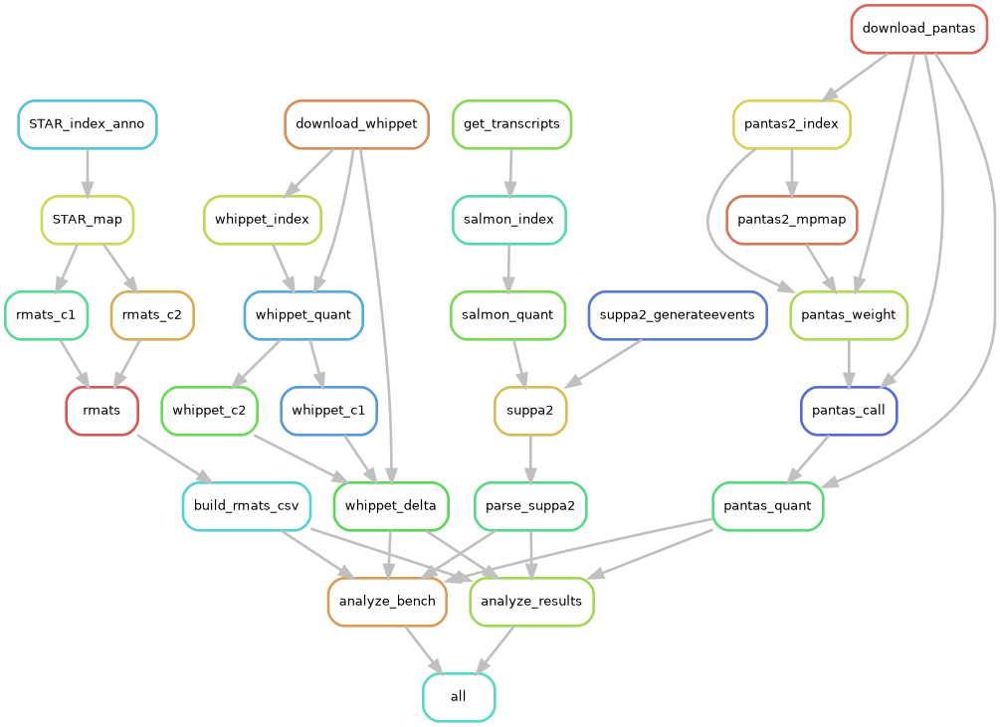

# Exps on Drosophila real data

## Setup input

### Reference genome
``` sh
wget http://ftp.flybase.net/releases/FB2023_02/dmel_r6.51/fasta/dmel-all-chromosome-r6.51.fasta.gz
gunzip dmel-all-chromosome-r6.51.fasta.gz
samtools faidx dmel-all-chromosome-r6.51.fasta 2L 2R 3L 3R 4 X Y > ref.chroms.fa
sed -i "s/^>/>chr/g" ref.chroms.fa
samtools faidx ref.chroms.fa
```

### Gene Annotation
``` sh
wget http://ftp.flybase.net/releases/FB2023_02/dmel_r6.51/gtf/dmel-all-r6.51.gtf.gz
for c in 2L 2R 3L 3R 4 X Y ; do zgrep -P "^$c\t" dmel-all-r6.51.gtf.gz ; done > genes.gtf
```

### RNA-Seq data
RNA-Seq samples from [https://doi.org/10.1016/j.dib.2021.107413](https://doi.org/10.1016/j.dib.2021.107413) (SRA BioProject ID: PRJNA718442). Filter reads with N.
``` sh
for sraid in SRR14101759 SRR14101760 SRR14101761 SRR14101762 SRR14101763 SRR14101764 ; do fasterq-dump -p -3 $sraid ; gzip "$sraid"_1.fastq ; gzip "$sraid"_2.fastq ; done
for sraid in SRR14101759 SRR14101760 SRR14101761 SRR14101762 SRR14101763 SRR14101764 ; do fastp -i "${sraid}"_1.fastq.gz -I "${sraid}"_2.fastq.gz -o "${sraid}"_l150_1_clean.fq.gz -O "${sraid}"_l150_2_clean.fq.gz -n 0 ; done
```

## Run experiments
Update `config/config.yaml` before.
``` sh
snakemake -pj 32 --use-conda [-n]
```

Plots and CSVs in `$ODIR/results`.

## Pipeline overview

